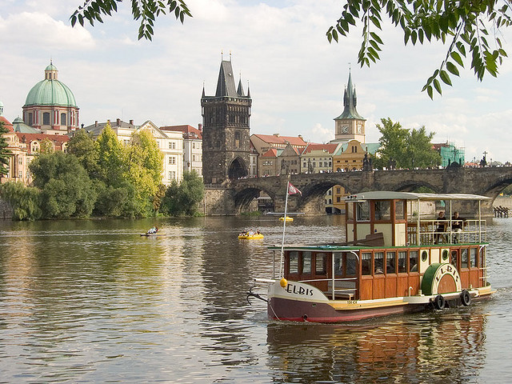

# SeamCarving

  An image resizing, object removal and object augmentation tool whose goal is to preserve the most important features of the given picture.
References can be found [here](https://perso.crans.org/frenoy/matlab2012/seamcarving.pdf)

Original image             |  Person removed
:-------------------------:|:-------------------------:
  |  

Original image             |  Height reduced
:-------------------------:|:-------------------------:
  |  

